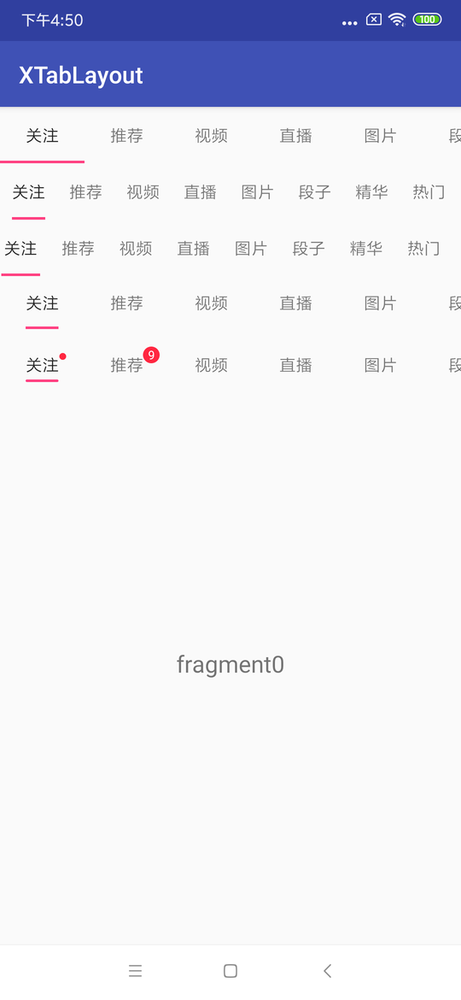

# XTabLayout

### 支持TabLayout的Indicator的width的自定义
### 新增Indicator的仿微博导航条效果
### 支持Indicator的圆角效果

仿微博导航条效果图：


能够自定义TabLayout宽度的效果图：



- 添加x_tabIndicatorWidth来支持TabLayout的Indicator的width的自定义，默认宽度28dp
- 添加x_tabIndicatorAnimation来控制是否支持类似微博的导航条动效，默认false不支持
- 添加x_tabIndicatorRoundRect来控制Indicator下划线的圆角效果，默认false没有圆角
- 支持在Tab上加入红点和红点数字


> 在对比几种修改TabLayout的Indicator的width的方法后，决定采用修改源码的方法来实现Indicator 宽度的自定义。（主要因为两种反射版本会压缩Tab边距的方式。）


#### XTabLayout的属性，在全部支持原生所有属性的情况添加了x_tabIndicatorWidth和x_tabIndicatorAnimation属性，并且因为是在原生TabLayout上的修改，原生TabLayout的API调用方式都支持。

```
<declare-styleable name="XTabLayout">
        <attr name="x_tabIndicatorWidth" format="dimension"/>
        <attr name="x_tabIndicatorAnimation" format="boolean"/>
        <attr name="x_tabIndicatorColor" format="color"/>
        <attr name="x_tabIndicatorHeight" format="dimension"/>
        <attr name="x_tabContentStart" format="dimension"/>
        <attr name="x_tabBackground" format="reference"/>
        <attr name="x_tabMode">
            <enum name="scrollable" value="0"/>
            <enum name="fixed" value="1"/>
        </attr>
        <attr name="x_tabGravity">
            <enum name="fill" value="0"/>
            <enum name="center" value="1"/>
        </attr>
        <attr name="x_tabMinWidth" format="dimension"/>
        <attr name="x_tabMaxWidth" format="dimension"/>
        <attr name="x_tabTextAppearance" format="reference"/>
        <attr name="x_tabTextColor" format="color"/>
        <attr name="x_tabSelectedTextColor" format="color"/>
        <attr name="x_tabPaddingStart" format="dimension"/>
        <attr name="x_tabPaddingTop" format="dimension"/>
        <attr name="x_tabPaddingEnd" format="dimension"/>
        <attr name="x_tabPaddingBottom" format="dimension"/>
        <attr name="x_tabPadding" format="dimension"/>
    </declare-styleable>
```

详情请见博客链接：[关于TabLayout的indicator宽度的一次探索](https://blog.csdn.net/h_gao/article/details/79784325)

关于
--

博客：[https://blog.csdn.net/H_Gao](https://blog.csdn.net/H_Gao)

邮箱：532294580@qq.com

License
--
Copyright 2018 JasonGaoH

Licensed under the Apache License, Version 2.0 (the "License"); you may not use this file except in compliance with the License. You may obtain a copy of the License at

http://www.apache.org/licenses/LICENSE-2.0

Unless required by applicable law or agreed to in writing, software distributed under the License is distributed on an "AS IS" BASIS, WITHOUT WARRANTIES OR CONDITIONS OF ANY KIND, either express or implied. See the License for the specific language governing permissions
